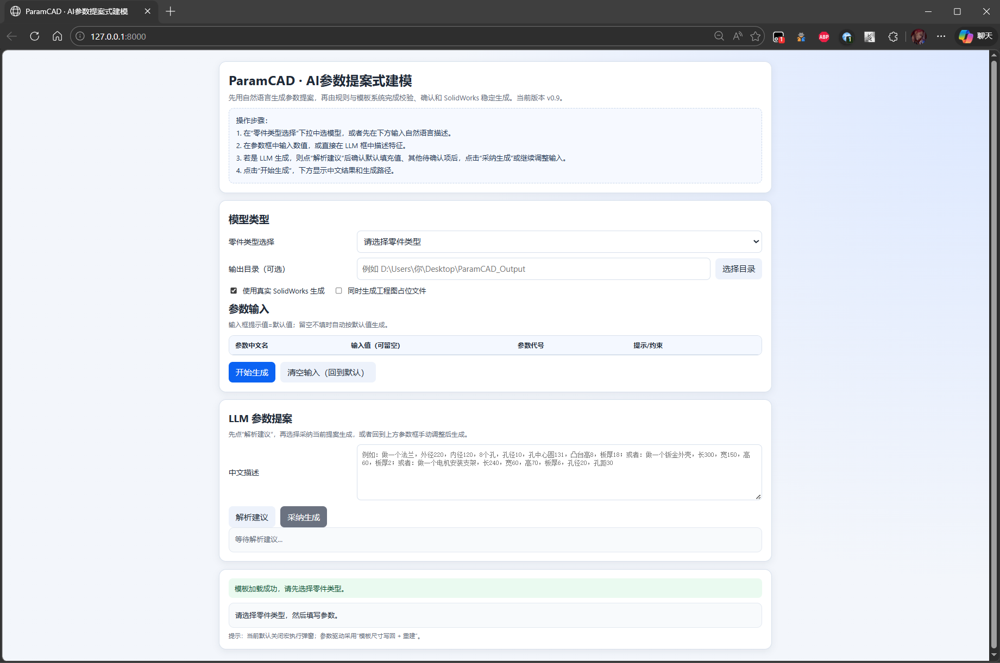
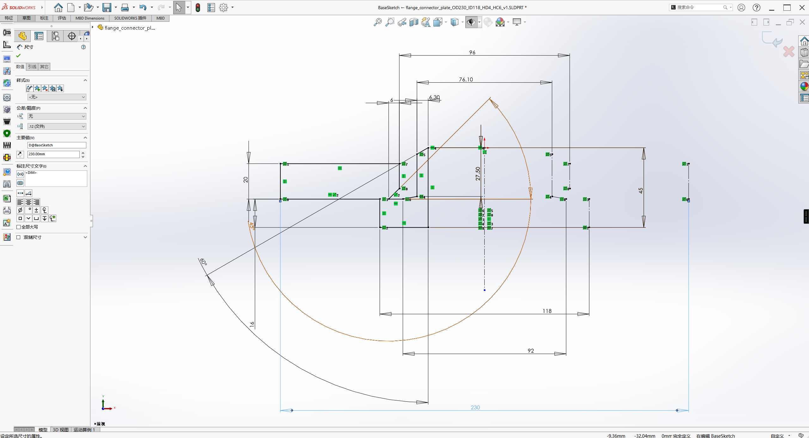
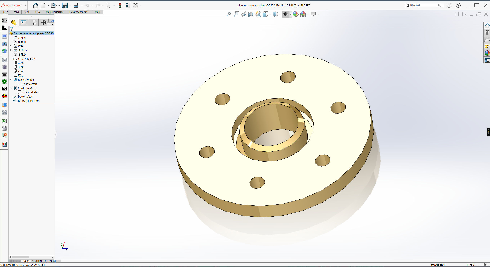
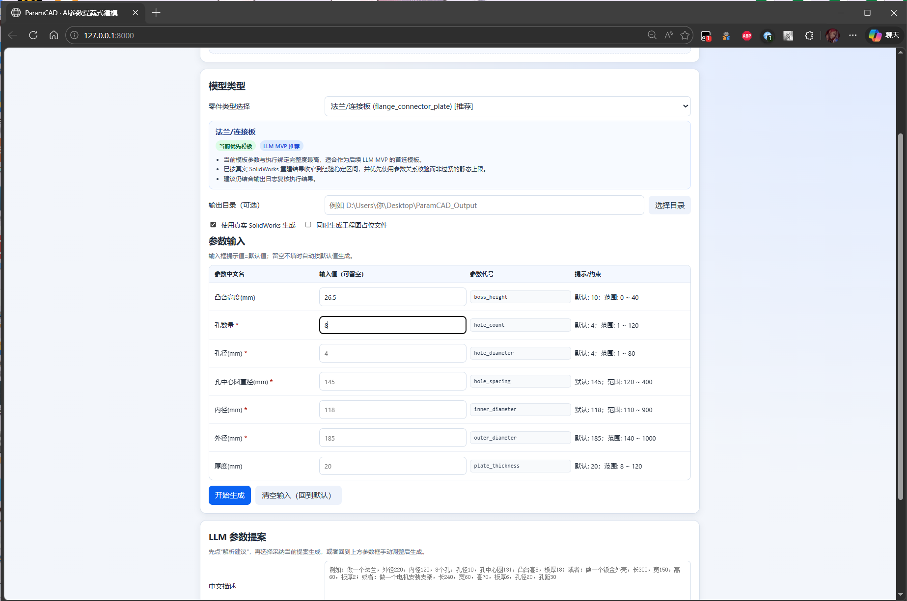
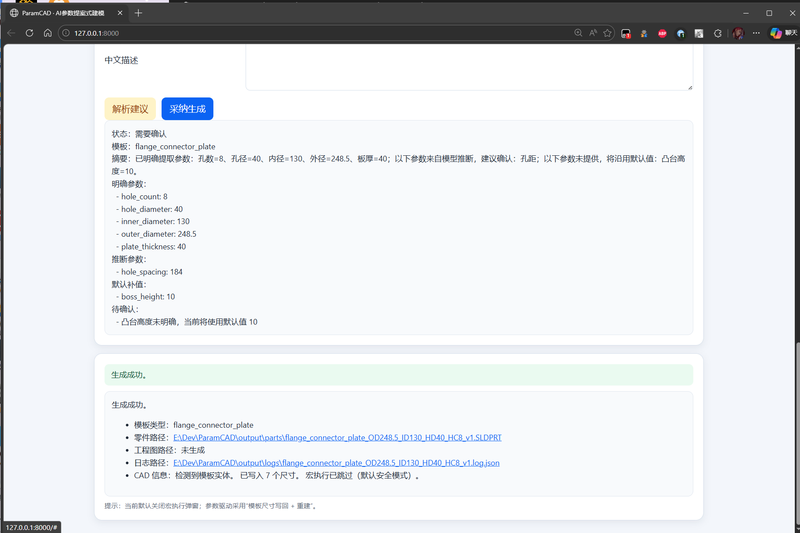

# ParamCAD · AI参数提案式建模

ParamCAD 是一个面向 SolidWorks 的本地参数化零件生成项目。目的为方便机械设计工程师快速准确生成特征相似的零部件。
核心机制是先把中文描述收束成结构化参数，再校对、校验让 SolidWorks 去稳定执行。能跑通从 Web 输入、参数校验、LLM 提案到本地生成与日志输出的整条路线。

<p align="center">
  
</p>

## 更新 版本特性 V0.9.0
1. 新增 `LLM 参数提案` 输入链路，支持中文描述转结构参数。
2. 新增“解析建议 -> 采纳生成”的确认式交互，缺失参数会补默认值，冲突参数会先提示。
3. 三个模板都完成了一轮稳定参数收束，法兰作为主路径，钣金外壳与电机支架按稳定子集开放。
4. Web 端结果、报错、确认提示优化，新增支持生成结果路径直接点击打开目录。
5. 优化参数校验逻辑、日志输出和 SolidWorks 调用稳定性。

## 项目模块功能

1. 支持 `JSON / Excel / Web` 三种输入方式。
2. 支持模板参数默认值补全、范围校验和模板级关系校验。
3. 支持 `LLM 参数提案`：中文描述会被解析成参数 patch、默认补值、待确认项、校验问题和轻量 `proposed_ops`。
4. 支持本地 SolidWorks 自动改参、rebuild、保存，并输出结果与日志。
5. 支持 Dry-run，方便在不连接 SolidWorks 的情况下先调流程。
6. 诊断报错，参数导致 rebuild 后没有实体，系统会直接报错弹原因并阻止无效零件生成。

当前已接入 3 个模板：

1. `flange_connector_plate` 法兰/连接板
2. `sheet_metal_cover` 钣金外壳
3. `motor_mount_bracket` 电机安装支架

## 使用流程

1. 在“零件类型选择”下拉中选模型，或者先在下方输入自然语言描述。
2. 在参数框中输入数值，或直接在 LLM 框中描述特征。
3. 若是 LLM 生成，则点“解析建议”后确认默认填充值、其他待确认项后，点击“采纳生成”或继续调整输入。
4. 点击“开始生成”，下方显示中文结果和生成路径。

先看手动参数输入路径：

<p align="center">
  
</p>

如果走自然语言提案，界面会先给出结构化建议，而不是直接执行：

<p align="center">
  
</p>

确认后再生成，结果区会显示中文状态、日志和可点击的输出路径：

<p align="center">
  
</p>

## 当前 LLM 的定位

当前为提案大模型预验证，非全智能 agent。

能做：

1. 识别模板。
2. 从中文里提取稳定参数子集。
3. 对缺失参数补默认值，并标记“需要确认”。
4. 识别明显冲突的参数/特征，并给出确认建议。


## 模板与当前稳定能力

### 1. 法兰/连接板 `flange_connector_plate`

当前参数：

1. `outer_diameter`
2. `inner_diameter`
3. `plate_thickness`
4. `hole_count`
5. `hole_diameter`
6. `hole_spacing`
7. `boss_height`

生成结果：

<p align="center">
  
</p>

参数填写：

<p align="center">
  
</p>

### 2. 钣金外壳 `sheet_metal_cover`

当前参数：

1. `length`
2. `width`
3. `height`
4. `plate_thickness`

生成结果：

<p align="center">
  
</p>

### 3. 电机安装支架 `motor_mount_bracket`

当前参数：

1. `length`
2. `width`
3. `height`
4. `plate_thickness`
5. `hole_diameter`
6. `hole_spacing`

拓展如 `hole_count`、`fillet_radius` 这类特征字段，当前作为“提议”。

## 快速启动

### 最省事的方式

直接双击根目录下的 [启动Web.bat](启动Web.bat)。

它会自动：

1. 检查 Python
2. 安装缺失依赖
3. 启动 API 服务
4. 打开浏览器

默认入口：

```text
http://127.0.0.1:8000
```

### 手动安装依赖

```powershell
python -m pip install -r requirements.txt
```

### CLI Dry-run

```powershell
python -m app.main --input examples/default_motor.json --dry-run
```

### CLI 真实生成

```powershell
python -m app.main --input examples/default_motor.json
```

## Web / API

当前常用接口：

1. `GET /` Web 页面
2. `GET /templates` 返回模板结构与提示
3. `POST /llm/plan` 中文描述转结构化提案
4. `POST /generate` 执行真实生成或 dry-run
5. `POST /open-path` 打开结果文件所在目录
6. `GET /health` 健康检查

如果你已经有自己的上层系统，直接调 `/llm/plan` 和 `/generate` 就够了。

## 输出内容

默认输出目录是 `output/`，运行后通常会看到这些内容：

1. `output/parts/*.SLDPRT` 零件文件
2. `output/parts/*.SLDDRW` 工程图占位文件
3. `output/macros/*.swp` 宏文件留档
4. `output/logs/*.log.json` 执行日志

命名采用版本递增，避免覆盖历史结果，例如：

```text
flange_connector_plate_OD248.5_ID130_HD40_HC8_v1.SLDPRT
```

## 项目结构

```text
app/
  core/        数据模型、模板管理、校验、能力声明
  services/    解析、LLM、宏生成、CAD 执行、流程编排
  api/         FastAPI 接口
static/
  template_registry.json
  template_bindings.json
  model_templates/
web/
  index.html
docs/
  images/readme/
```

几个最关键的文件：

1. [app/services/llm_planner.py](app/services/llm_planner.py)
2. [app/services/cad_executor.py](app/services/cad_executor.py)
3. [app/core/validation.py](app/core/validation.py)
4. [static/template_registry.json](static/template_registry.json)
5. [static/template_bindings.json](static/template_bindings.json)
6. [web/index.html](web/index.html)

## 运行环境

必需环境：

1. Windows 10/11
2. Python 3.11+
3. SolidWorks 2024 附近版本

依赖见 [requirements.txt](requirements.txt)，其中 `pywin32` 只在真实 SolidWorks 生成时需要。


## 说明

本项目依赖本地 COM 调用 SolidWorks，受安装版本、模板质量和权限环境影响较大。正式使用前，建议先用 Dry-run 或小样例回归一轮，再切换真实 CAD 生成。


## 后续方向

1. 三视图生成转 DWG。
2. 收束优化模板草图，开发更多稳定参数；往 AGENT 靠拢。
