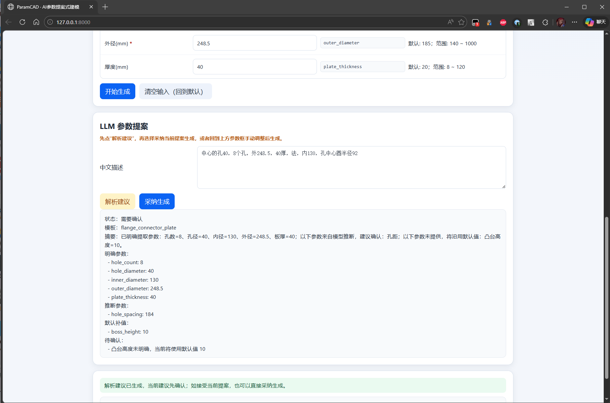
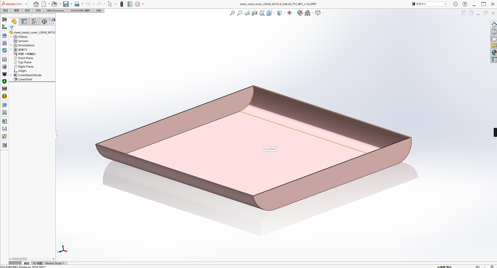

# ParamCAD

ParamCAD is a local parametric part generation project for SolidWorks. It turns structured inputs or Chinese natural-language requests into validated parameters, then drives SolidWorks to rebuild and save the final part.

The project is aimed at mechanical design workflows where similar parts need to be generated quickly, consistently, and with clear validation feedback.

<p align="center">
  
</p>

## What it does

1. Supports `JSON`, `Excel`, and `Web` inputs.
2. Validates template defaults, parameter ranges, and template-level rules.
3. Supports an `LLM planning` step that converts Chinese descriptions into a structured proposal before generation.
4. Runs either `dry-run` mode or real SolidWorks generation.
5. Produces part files, optional drawing output, macros, and execution logs.

Current templates:

1. `flange_connector_plate`
2. `sheet_metal_cover`
3. `motor_mount_bracket`

## How it works

The workflow is intentionally split into two stages:

1. Parse input into structured parameters.
2. Validate, confirm, and execute CAD generation.

For natural-language input, the system does not generate immediately. It first returns a proposal that may include:

1. Template guess
2. Parameter patch
3. Default-filled values
4. Items that still need confirmation
5. Validation warnings or conflicts

This makes the LLM act as a planner, not a fully autonomous CAD agent.

## Quick start

The easiest way on Windows is to run [启动Web.bat](启动Web.bat). It will:

1. Find Python
2. Install missing dependencies
3. Start the FastAPI server
4. Open the browser at `http://127.0.0.1:8000`

Manual install:

```powershell
python -m pip install -r requirements.txt
```

Run the web server manually:

```powershell
python -m uvicorn app.api.main:app --host 127.0.0.1 --port 8000 --reload
```

CLI dry-run:

```powershell
python -m app.main --input examples/default_motor.json --dry-run
```

CLI real generation:

```powershell
python -m app.main --input examples/default_motor.json
```

## Web flow

1. Select a template or describe the part in Chinese.
2. Fill parameters manually, or ask the LLM to prepare a plan.
3. Review the proposed values and confirmation items.
4. Start generation and inspect the returned output path and log.

<p align="center">
  
</p>

## API

Main endpoints:

1. `GET /` Web UI
2. `GET /templates` Template definitions and capability info
3. `POST /llm/plan` Natural language to structured proposal
4. `POST /generate` Run dry-run or real generation
5. `POST /open-path` Open an output path in Explorer
6. `GET /health` Health check

If you already have your own upper-layer system, `/llm/plan` and `/generate` are the main integration points.

## Output

Default output root: `output/`

Typical artifacts:

1. `output/parts/*.SLDPRT`
2. `output/parts/*.SLDDRW`
3. `output/macros/*.swp`
4. `output/logs/*.log.json`

Generated files use incremental versioning to avoid overwriting older results.

## Project structure

```text
app/
  core/        Data models, template management, validation, capability metadata
  services/    Parsing, LLM planning, macro generation, CAD execution, pipeline orchestration
  api/         FastAPI entrypoints
static/
  template_registry.json
  template_bindings.json
  model_templates/
web/
  index.html
docs/
  images/readme/
```

Key files:

1. `app/services/llm_planner.py`
2. `app/services/cad_executor.py`
3. `app/core/validation.py`
4. `static/template_registry.json`
5. `static/template_bindings.json`
6. `web/index.html`

## Requirements

1. Windows 10 or 11
2. Python 3.11+
3. A nearby SolidWorks 2024 version for real generation

Dependencies are listed in [requirements.txt](requirements.txt). `pywin32` is only needed when running real SolidWorks automation.

## Notes

ParamCAD depends on local COM automation for SolidWorks, so behavior can be affected by the installed SolidWorks version, template quality, and local permission settings.

It is recommended to validate new templates or workflow changes with `dry-run` before switching to real CAD execution.
